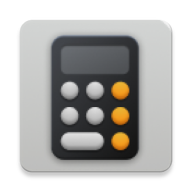

# MagicComputer

  

  

> 一款基于 **2026年春晚魔术** 的智能计算 App，使用 **Kotlin + MVVM** 架构打造，支持个性化输入、步骤引导、结果展示，全流程神奇有趣。

---

## 🎩 

## 🧰 技术栈

| 模块 | 技术 |
|------|------|
| **语言** | Kotlin |
| **架构** | MVVM |
| **UI框架** | Android Views + Material Design |
| **异步编程** | Kotlin Coroutines |
| **构建工具** | Gradle |
| **其他** | 模块化架构 / 输入验证 / 状态管理 |

---

